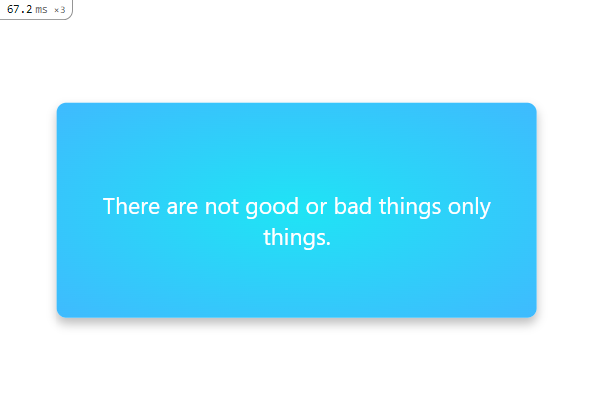

# Hello Rails React - Ruby on Rails

Hello Rails React is an application using Ruby on Rails and react-rails gem.
## 🔴 Preview



## :hammer: Built With

- Ruby on Rails
- react-rails gem

To get a local copy up and running follow these simple steps:

**First Steps**

1. Clone it using git command:
```ruby
git clone https://github.com/ArthurGC/Hello-Rails-React-v1.git
```

**Run in development (locally)**

1. Install gem files and dependencies:
```ruby
bundle install
```
```ruby
npm install
```
2. Setup you database.yml with your own postgres's password or create a PASS_POSTGRES environment variable 
```ruby
  password: <%= ENV["PASS_POSTGRESQL"] %>
```
4. Setup db and seed file
```ruby
rails db:setup
```
```ruby
rails db:seed
```
5. Run server
```ruby
rails server
```

**Run tests**

- Under construction


## :blue_book: Learning Objectives

- Implement a connection between a Ruby on Rails back-end and React front-end.
- Understand the pros and cons of different approaches of connecting Ruby on Rails back-end with React front-end.

## Author

👤 **ArthurGC**

- GitHub: [@ArthurGC](https://github.com/ArthurGC)
- Twitter: [@ArthurGC_22](https://twitter.com/ArthurGC_22)
- LinkedIn: [alxguzmanc](https://www.linkedin.com/in/alxguzmanc/)

## 🤝 Contributing

Contributions, issues, and feature requests are welcome!

Feel free to check the [issues page](https://github.com/ArthurGC/Hello-Rails-React-v1/issues).

## Show your support

Give a ⭐️ if you like this project!

## 📝 License

This project is [MIT](LICENSE) licensed.

